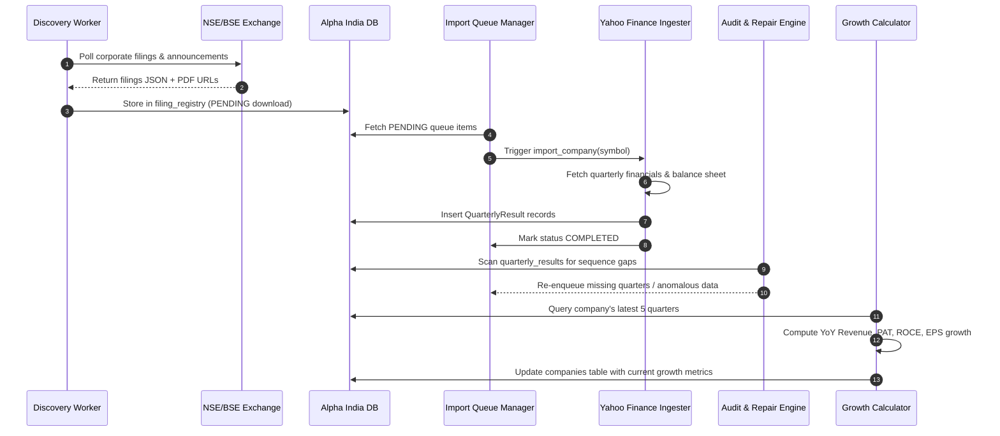

# Alpha India Data Ingestion & Processing Pipelines

This document details the multi-stage ingestion, transformation, audit, and calculation engines operating across Alpha India.

---

## 1. Pipeline Architecture Overview

---

## 2. Ingestion Stages & Workers

### Stage 1: Market Universe Ingestion
- **Script**: `scripts/import_nse_companies.py` / `download_nse_master.py`
- **Source**: NSE official equity archives (`EQUITY_L.csv`) and BSE master exports.
- **Output**: Populates `companies` table with `symbol`, `company`, `isin`, `series`, `listing_date`.

### Stage 2: Historical & Real-Time Discovery Engine
- **Service**: [DiscoveryService](file:///c:/Users/amitr/AlphaIndia/backend/app/services/discovery_service.py)
- **Worker**: [discovery_worker.py](file:///c:/Users/amitr/AlphaIndia/backend/app/services/discovery_worker.py)
- **Collector**: [nse_collector.py](file:///c:/Users/amitr/AlphaIndia/backend/app/collectors/nse_collector.py)
- **Schedule**: Continuous polling (5-second intervals during market hours, batch historical discovery during off-market hours).
- **Target**: Registers announcement dates, filing periods, and direct PDF URLs into `filing_registry`.

### Stage 3: Yahoo Finance Financial Warehouse Importer
- **Service**: [YahooImportService](file:///c:/Users/amitr/AlphaIndia/backend/app/services/yahoo_import_service.py)
- **Worker**: [financial_import_worker.py](file:///c:/Users/amitr/AlphaIndia/backend/app/services/financial_import_worker.py)
- **Queue**: [financial_queue_manager.py](file:///c:/Users/amitr/AlphaIndia/backend/app/services/financial_queue_manager.py)
- **Symbol Resolution**: [yahoo_symbol_resolver.py](file:///c:/Users/amitr/AlphaIndia/backend/app/services/yahoo_symbol_resolver.py) appends `.NS` (for National Stock Exchange) or `.BO` (for Bombay Stock Exchange).
- **Extracted Datasets**:
  - `income_df = client.quarterly_income_statement(symbol)`
  - `balance_df = client.quarterly_balance_sheet(symbol)`
- **Deduplication**: Checks existing `(company_id, period_end)` before creating records in `quarterly_results`.

### Stage 4: Financial Warehouse Audit & Repair Engine
- **Service**: [FinancialAuditEngine](file:///c:/Users/amitr/AlphaIndia/backend/app/services/financial_audit_engine.py)
- **Repair**: [financial_repair_service.py](file:///c:/Users/amitr/AlphaIndia/backend/app/services/financial_repair_service.py)
- **Backfill**: [financial_audit_backfill_engine.py](file:///c:/Users/amitr/AlphaIndia/backend/app/services/financial_audit_backfill_engine.py)
- **Checks Performed**:
  - Gap Analysis: Identifies missing quarterly periods between oldest and latest quarter.
  - Anomaly Filter: Identifies zero-revenue or negative asset anomalies.
  - Orphan Resolution: Re-links records without valid foreign keys.

### Stage 5: Growth Metric & AI Scoring Engine
- **Service**: [GrowthCalculatorService](file:///c:/Users/amitr/AlphaIndia/backend/app/services/growth_calculator_service.py)
- **Requirements**: Requires a minimum of 5 historical quarters for a company to calculate true Year-Over-Year comparisons:
  - $Q_0$ = Latest reported quarter.
  - $Q_4$ = Same quarter of the previous fiscal year.
- **Metrics Computed**:
  - `revenue_growth = ((latest.revenue - previous_year.revenue) / previous_year.revenue) * 100`
  - `pat_growth = ((latest.net_profit - previous_year.net_profit) / abs(previous_year.net_profit)) * 100`
  - `eps_growth = ((latest.eps - previous_year.eps) / abs(previous_year.eps)) * 100`
  - `roce = (operating_income / (total_assets - current_liabilities)) * 100`
- **Storage**: Persisted on `companies` table for sub-millisecond query performance on screener filtering and global sorting.
