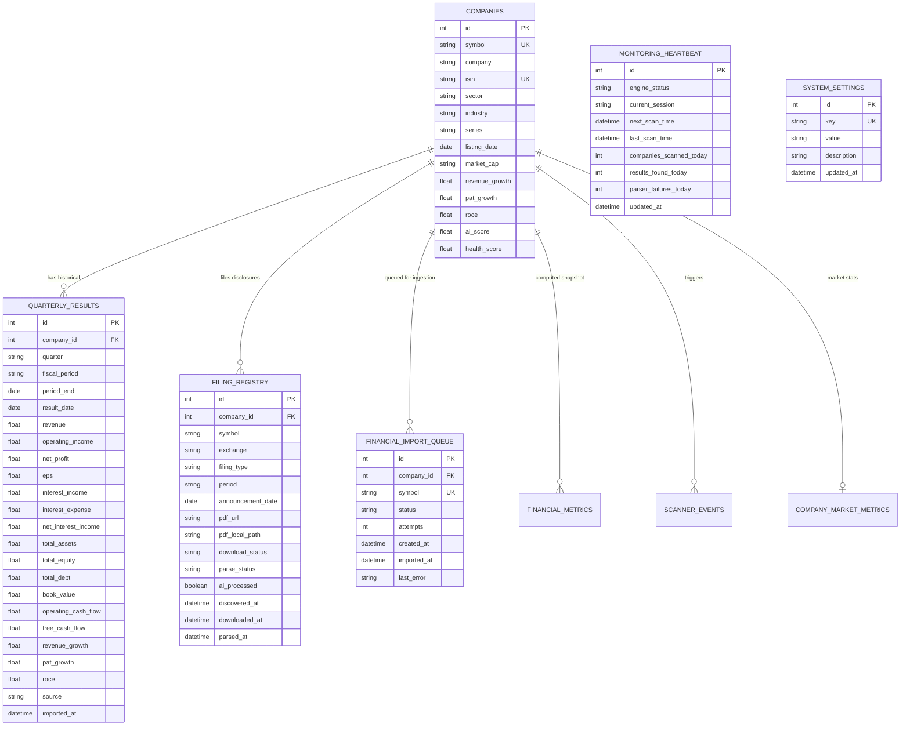

# Alpha India Database Architecture & Schema Deep-Dive

Alpha India utilizes SQLAlchemy ORM with support for PostgreSQL (Production) and SQLite (Recovery & Development).

---

## 1. Entity Relationship Diagram



---

## 2. Table Specifications

### `companies`
- **Path**: [app/models/company.py](file:///c:/Users/amitr/AlphaIndia/backend/app/models/company.py)
- **Primary Key**: `id` (Auto-increment integer)
- **Unique Indexes**: `symbol` (Indexed, Unique, Uppercase ticker), `isin` (Indexed, Unique)
- **Columns**:
  - `symbol`: Stock symbol (e.g. `RELIANCE`, `TCS`, `INFY`).
  - `company`: Full legal name.
  - `sector`: Industrial sector (e.g. `Information Technology`, `Financial Services`).
  - `industry`: Sub-industry.
  - `exchange`: Listing exchange (`NSE` or `BSE`).
  - `market_cap`: Formatted market capitalization string.
  - `revenue_growth`: Calculated YoY revenue growth percentage.
  - `pat_growth`: Calculated YoY profit-after-tax growth percentage.
  - `roce`: Calculated Return on Capital Employed percentage.
  - `health_score` / `ai_score`: Composite financial strength score (0 to 100).

### `quarterly_results`
- **Path**: [app/models/quarterly_result.py](file:///c:/Users/amitr/AlphaIndia/backend/app/models/quarterly_result.py)
- **Primary Key**: `id`
- **Foreign Key**: `company_id` -> `companies.id` (Indexed)
- **Composite Uniqueness constraint**: (`company_id`, `period_end`) prevents duplicate quarterly ingestion.
- **Financial Items Tracked**:
  - Income Statement: `revenue`, `operating_income`, `net_profit`, `eps`, `interest_income`, `interest_expense`, `net_interest_income`.
  - Balance Sheet: `total_assets`, `total_equity`, `total_debt`, `book_value`.
  - Cash Flow: `operating_cash_flow`, `free_cash_flow`.
  - Growth Snapshot: `revenue_growth`, `pat_growth`, `roce`.
  - Metadata: `source` (e.g. `YAHOO_FINANCE`, `EXCHANGE_FILING`), `imported_at`.

### `filing_registry`
- **Path**: [app/models/filing_registry.py](file:///c:/Users/amitr/AlphaIndia/backend/app/models/filing_registry.py)
- **Primary Key**: `id`
- **Foreign Key**: `company_id` -> `companies.id`
- **Tracks exchange PDF lifecycle**:
  - `download_status`: `PENDING` | `COMPLETED` | `FAILED`
  - `parse_status`: `WAITING` | `IN_PROGRESS` | `COMPLETED` | `ERROR`
  - `ai_processed`: Boolean flag for LLM/NLP extraction status.

### `financial_import_queue`
- **Path**: [app/models/financial_import_queue.py](file:///c:/Users/amitr/AlphaIndia/backend/app/models/financial_import_queue.py)
- **State Machine**:
  - `PENDING`: Waiting for worker.
  - `RUNNING`: Ingestion currently in progress.
  - `COMPLETED`: Ingestion successful (all available statements extracted).
  - `FAILED`: Network or parsing error occurred (increment `attempts`).
  - `UNAVAILABLE`: Symbol not resolved on Yahoo Finance (e.g. delisted/non-standard).

---

## 3. Database Engine & Configuration
- **File**: [app/db/database.py](file:///c:/Users/amitr/AlphaIndia/backend/app/db/database.py)
- **Engine Setup**:
  ```python
  engine = create_engine(
      DATABASE_URL,
      echo=True,          # Log executed queries during dev
      pool_pre_ping=True, # Auto-reconnect on dropped connections
  )
  ```
- **Connection String**: Provided via `DATABASE_URL` in `backend/.env`.
- **Dependency**: `get_db()` provides a transactional scoped session with `try ... finally: db.close()`.
