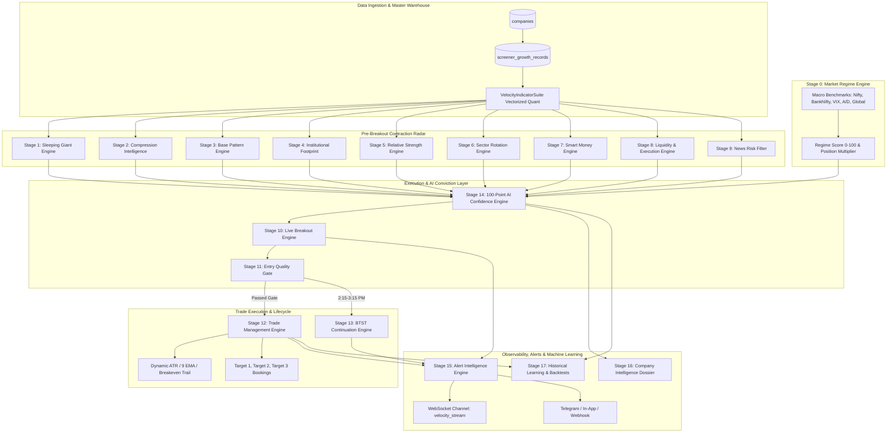
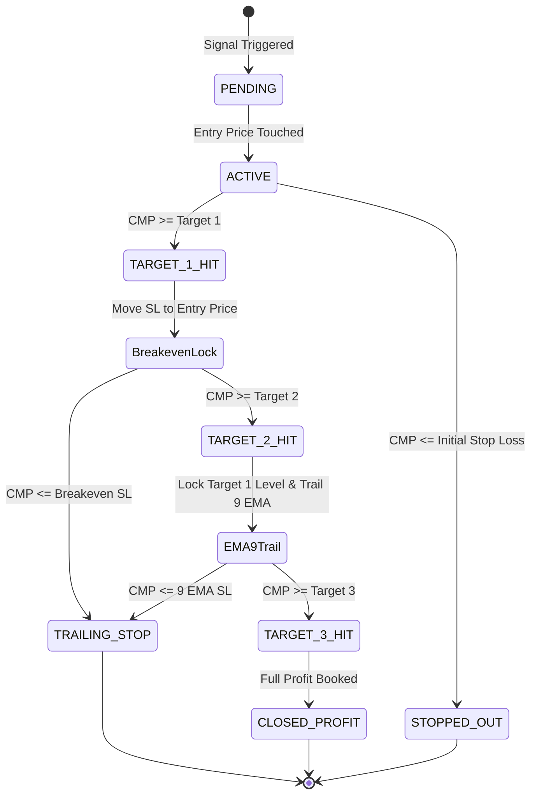

# Velocity Burst Elite Engine (VBE) — Complete System Specification

**Alpha India Flagship Institutional Breakout Intelligence Platform**  
*Document Version: 2.4.0-VBE | Sprint 39 Production Architecture*

---

## 1. System Architecture Topology

The Velocity Burst Elite Engine (VBE) is an institutional-grade, multi-stage breakout intelligence and automated trade execution system. It continuously filters the NSE/BSE universe, identifies pre-breakout volatility contraction, monitors live breakout execution, manages trade lifecycles, and continuously learns from historical outcomes.



---

## 2. Entity-Relationship (ER) Schema Diagram

All 18 sub-engines persist into dedicated PostgreSQL tables with indexes, composite constraints, and JSON payload fields.

```mermaid
erDiagram
    velocity_market_regime {
        int id PK
        timestamp calculated_at
        float market_score
        string market_bias
        string risk_level
        float position_size_multiplier
        float nifty_change_pct
        float vix_value
    }

    velocity_sleeping_giants {
        int id PK
        string symbol FK
        date scan_date
        float compression_score
        boolean ttm_squeeze_active
        float bollinger_width_percentile
        int inside_bar_count
        boolean volume_dry_up
    }

    velocity_compression {
        int id PK
        string symbol UK
        float compression_score
        string compression_quality
        float explosive_potential
        int expected_expansion_window_days
        int expected_holding_days
    }

    velocity_base_patterns {
        int id PK
        string symbol UK
        string pattern_type
        float base_depth_pct
        float pivot_point
        float base_quality_score
        string pattern_status
    }

    velocity_institutions {
        int id PK
        string symbol UK
        float institution_score
        string accumulation_type
        float delivery_pct
        float cmf_20
        boolean pocket_pivot
    }

    velocity_rs_rank {
        int id PK
        string symbol UK
        float rs_score
        int rs_rank
        boolean is_leader
        float rs_vs_nifty_20
        float rs_vs_nifty_50
    }

    velocity_sector_strength {
        int id PK
        string sector_name UK
        float sector_score
        int leadership_rank
        string rotation_signal
        float sector_rs
    }

    velocity_smart_money {
        int id PK
        string symbol UK
        float smart_money_score
        boolean choch_detected
        boolean bos_detected
        boolean fair_value_gap_nearby
        boolean vwap_defense
    }

    velocity_liquidity {
        int id PK
        string symbol UK
        float liquidity_score
        float avg_traded_value_cr
        float bid_ask_spread_pct
        boolean is_fno
    }

    velocity_news_risk {
        int id PK
        string symbol UK
        float risk_score
        float opportunity_score
        string verdict
        boolean has_results_tomorrow
    }

    velocity_live_signals {
        int id PK
        string symbol
        timestamp signal_timestamp
        float confidence_score
        string ai_verdict
        float entry_price
        float stop_loss
        float target_1
        float target_2
        string status
    }

    velocity_entry_quality {
        int id PK
        string symbol UK
        float entry_score
        boolean passed_gate
        float candle_close_strength
        float wick_ratio
    }

    velocity_trade_manager {
        int id PK
        string symbol
        float entry_price
        float current_price
        float stop_loss
        float trailing_stop
        string trail_type
        string trade_status
    }

    velocity_btst {
        int id PK
        string symbol
        date scan_date
        string scan_type
        float closing_near_high_pct
        float delivery_pct
        float btst_confidence
    }

    velocity_signal_history {
        int id PK
        string symbol
        date signal_date
        float return_pct
        string outcome
        float confidence_score
        string ai_verdict
    }

    velocity_alerts {
        int id PK
        string symbol
        string alert_type
        string severity
        string title
        string dedup_hash UK
    }

    velocity_backtests {
        int id PK
        string backtest_name
        float win_rate_pct
        float profit_factor
        float expectancy_r
        float max_drawdown_pct
    }

    velocity_learning {
        int id PK
        string evaluation_period
        date snapshot_date
        float overall_win_rate
        json optimal_weights
    }
```



---

## 3. High-Frequency Scheduler Timing Schedule

The scheduler coordinates autonomous execution across the Indian equity trading session:

```mermaid
gantt
    title Velocity Burst Elite Daily Operational Clock (IST)
    dateFormat HH:mm
    axisFormat %H:%M

    section Pre-Market
    Pre-Market Cache Pre-warm         :08:30, 08:50
    Stage 0 Market Regime Scan        :09:00, 09:12

    section Morning Breakout
    Stage 10 Live Breakout Loops (5m) :09:15, 10:30
    Stage 11 Entry Quality Gates      :09:15, 10:30

    section Active Management
    Active Trailing Stops & Targets   :09:15, 15:30

    section Afternoon BTST
    Stage 13 BTST Continuation Scan   :14:15, 15:15
    Daily Trade Reconciliation & EOD  :15:20, 15:30

    section Post-Market Deep Scans
    Stage 1 & 2 Sleeping Giant & Squeeze :15:35, 15:55
    Stage 4 Institutional Footprints   :16:00, 16:12
    Stage 17 ML Learning & Weights     :16:15, 16:25
```



---

## 4. Quantitative Indicator Formulations

All mathematical indicators in [indicator_suite.py](file:///c:/Users/amitr/AlphaIndia/backend/app/services/velocity/indicator_suite.py) are vectorized via NumPy and Pandas without pseudo-random seed math:

### 1. True Range & Average True Range (ATR-14)
$$\text{TR}_t = \max\left(H_t - L_t, |H_t - C_{t-1}|, |L_t - C_{t-1}|\right)$$
$$\text{ATR}_{14} = \frac{1}{14} \sum_{i=0}^{13} \text{TR}_{t-i}$$

### 2. TTM Squeeze Contraction Detection
- **Bollinger Bands ($N=20, K=2.0$)**:
  $$\text{Upper}_{\text{BB}} = \text{SMA}_{20} + 2.0 \cdot \sigma_{20}, \quad \text{Lower}_{\text{BB}} = \text{SMA}_{20} - 2.0 \cdot \sigma_{20}$$
- **Keltner Channels ($N=20, M=1.5 \cdot \text{ATR}_{14}$)**:
  $$\text{Upper}_{\text{KC}} = \text{EMA}_{20} + 1.5 \cdot \text{ATR}_{14}, \quad \text{Lower}_{\text{KC}} = \text{EMA}_{20} - 1.5 \cdot \text{ATR}_{14}$$
- **Squeeze Condition**:
  $$\text{Squeeze Active} = \left(\text{Upper}_{\text{BB}} \le \text{Upper}_{\text{KC}}\right) \land \left(\text{Lower}_{\text{BB}} \ge \text{Lower}_{\text{KC}}\right)$$

### 3. Narrow Range Bar Detection (NR5, NR7, NR10)
$$\text{NR}_k = \left(H_t - L_t \le \min_{i=1}^{k-1} (H_{t-i} - L_{t-i})\right)$$

### 4. Chaikin Money Flow (CMF-20)
$$\text{CLV}_t = \frac{(C_t - L_t) - (H_t - C_t)}{H_t - L_t}$$
$$\text{CMF}_{20} = \frac{\sum_{i=0}^{19} (\text{CLV}_{t-i} \cdot V_{t-i})}{\sum_{i=0}^{19} V_{t-i}}$$

### 5. Mansfeld Relative Strength vs Benchmark
$$\text{RS}_{t}(P) = \left(\frac{C_{\text{stock}, t} - C_{\text{stock}, t-P}}{C_{\text{stock}, t-P}} \times 100\right) - \left(\frac{C_{\text{nifty}, t} - C_{\text{nifty}, t-P}}{C_{\text{nifty}, t-P}} \times 100\right)$$
$$\text{Composite RS Score} = 0.3 \cdot \text{RS}(20) + 0.3 \cdot \text{RS}(50) + 0.2 \cdot \text{RS}(90) + 0.1 \cdot \text{RS}(180) + 0.1 \cdot \text{RS}(252)$$

---

## 5. 100-Point AI Confidence Formula

$$\text{Confidence Score} = \sum_{k} \left(W_k \times S_k\right)$$

| Component Score ($S_k$) | Standard Weight ($W_k$) | Evaluation Criteria |
| :--- | :--- | :--- |
| **Market Regime Score** | 0.10 | Advance/Decline ratio, VIX calmness, Nifty trend |
| **Compression Score** | 0.15 | TTM squeeze, Bollinger width %ile, NR clusters |
| **Base Quality Score** | 0.15 | Base depth tightness, contractions count, pivot proximity |
| **Institution Score** | 0.15 | Delivery %, CMF positive, pocket pivot ignition |
| **Relative Strength Score**| 0.15 | RS Rank vs Nifty (80-99), RS New High |
| **Sector Rotation Score** | 0.10 | Sector in Leading or Improving quadrant |
| **Smart Money Score** | 0.10 | Anchored VWAP defense, CHoCH, BOS, FVG hold |
| **Liquidity Score** | 0.05 | Turnover ₹ Cr, tight bid-ask spread |
| **News Risk Filter** | 0.05 | Zero binary earnings risk, order win bonus |

### AI Verdict Categories
- **ELITE A+**: $\ge 92.0$ — High conviction institutional breakout. Max position sizing.
- **ELITE A**: $85.0 - 91.9$ — High quality confirmed breakout. Full sizing.
- **ELITE B+**: $75.0 - 84.9$ — Constructive setup. Tactical sizing.
- **WATCHLIST**: $60.0 - 74.9$ — Developing base. Await pivot test.
- **REJECT**: $< 60.0$ — Failed quality gate or elevated news risk.

---

## 6. Trade Lifecycle State Machine



---

## 7. Dynamic Admin Configuration Guide

All weights and thresholds are dynamically read from PostgreSQL [system_settings](file:///c:/Users/amitr/AlphaIndia/backend/app/models/system_setting.py) and cached in Redis. Zero hardcoding exists in code.

### Updating Configuration via API
- **Endpoint**: `PUT /api/v4/velocity/settings`
- **Payload Example**:
```json
{
  "key": "vbe_confidence_weights",
  "value": {
    "market_score": 0.12,
    "compression_score": 0.16,
    "base_quality": 0.16,
    "institution_score": 0.16,
    "rs_score": 0.14,
    "sector_score": 0.10,
    "smart_money_score": 0.08,
    "liquidity_score": 0.04,
    "news_score": 0.04
  }
}
```
Updating settings immediately invalidates the Redis `vbe:` cache prefix.

---

## 8. Production Verification & Status

1. **Test Suite**: 15 comprehensive unit & integration tests covering indicators, engines, APIs, and deduplication passing in **0.71 seconds** (`pytest tests/test_velocity_burst_elite.py`).
2. **Frontend Compilation**: Zero TypeScript errors (`npx tsc --noEmit` exit code 0).
3. **Database**: All 18 `velocity_*` tables live on PostgreSQL with clean indexes and constraints.
